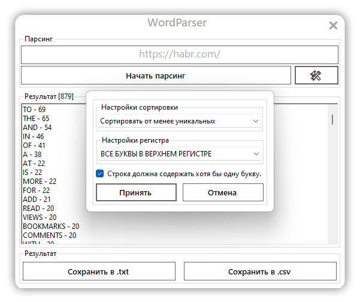

# WordParser - Тестовое задание на Backend-практикум
</br>
## Требования к приложению:
1. В качестве входных данных приложение принимает строку с адресом
web-страницы;
2. Приложение разбивает текст страницы на отдельные слова с помощью
списка разделителей.
</br>Пример списка:
```{' ', ',', '.', '! ', '?','"', ';', ':', '[', ']', '(', ')', '\n', '\r', '\t'}```
3. В качестве результата работы пользователь должен получить статистику по
количеству уникальных слов в тексте.
</br></br>**Пример:**
```
РАЗРАБОТКА - 1
ПРОГРАММНОГО - 2
ОБЕСПЕЧЕНИЯ - 4
```
</br>

4. При разработке позволяется использовать сторонние библиотеки;
5. Приложение написано в соответствии с принципами ООП;
6. Приложение написано на языке выбранного направления (Java, C#, Golang).
</br>
